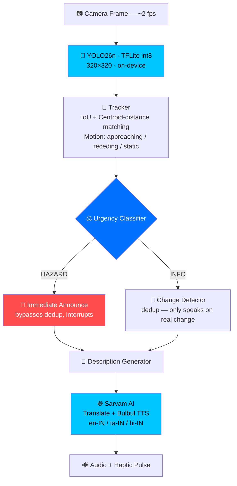

<picture>
  <source media="(prefers-color-scheme: dark)" srcset="https://capsule-render.vercel.app/api?type=waving&color=0:00c6ff,100:0072ff&height=220&section=header&text=LensVoice&fontSize=60&fontColor=fff&animation=fadeIn&fontAlignY=38">
  
</picture>

<p align="center">
  
</p>

<p align="center">
  
  
  
  
</p>

<p align="center">
  <a href="#-the-problem"></a>
  <a href="#-architecture"></a>
  <a href="#-the-model"></a>
  <a href="#-build--run"></a>
  <a href="#-tech-stack"></a>
</p>

<p align="center">
  
</p>

---

## 🧠 The Problem

> *"Every 6 seconds, someone in the world becomes blind."* — WHO

There are **285 million visually impaired people** globally. Navigation is their single biggest daily challenge — crossing a road, walking through a crowded market, detecting an approaching vehicle.

Existing solutions are either:
- **Hardware-locked** (expensive smart canes, camera-equipped white canes)
- **Backend-dependent** (require constant WiFi + a server — fail in the real world)
- **Silent on hazards** (GPS apps don't tell you about the auto-rickshaw speeding toward you)

**LensVoice is the alternative.** A single APK. Zero infrastructure. Your phone becomes a real-time co-pilot that speaks in your language.

---

## 🎯 The Vision

This is not a "research demo." This is a working proof that the software layer for the next generation of **AI-assisted accessibility wearables** doesn't need a data center behind it.

- **Glasses-ready architecture:** the same on-device pipeline (TFLite → Tracker → Urgency → TTS) that runs on a phone today is the exact pipeline dedicated glasses hardware with an NPU would run tomorrow — no redesign needed, just a smaller camera.
- **Language-native:** English, Tamil, Hindi at launch, powered by Sarvam AI's Indian-language-first models. Not gating accessibility behind English literacy.
- **Privately yours:** no backend server, no images ever leave the device. The only network call is to Sarvam for translation + speech synthesis.

> **"If a visually impaired person can't afford $3,000 smart glasses, their phone + LensVoice should be enough."**

---

## 🏗️ Architecture



**Key design decisions:**
- **No backend.** The app is fully self-contained — YOLO inference runs on-device via `tflite_flutter`. The only internet dependency is Sarvam AI for translation + TTS.
- **Hazards interrupt.** Info announcements queue. If a car is approaching while the app is mid-sentence about a traffic sign, *the car wins* — urgency is not up for debate.
- **Change detection prevents spam.** The `ChangeDetector` remembers what was last said about each object and only re-announces if position or distance changes meaningfully.
- **Tracker uses centroid fallback, not just IoU.** When an object moves fast between frames and bounding boxes barely overlap, pure IoU-matching loses track of it — a real bug caught and fixed during development. Centroid-distance as a fallback signal keeps tracking stable even on fast-approaching hazards.

<details>
<summary><strong>🩻 Click to see the on-device inference internals</strong></summary>

<br>

The exported TFLite model outputs a raw, undecoded tensor — `[1, 19, 2100]` (4 box params + 15 class scores × 2100 grid cells), not a convenience-wrapped result. The Dart-side decoder:
1. Reads `cx, cy, w, h` per grid cell, converts to `x1,y1,x2,y2`
2. Applies sigmoid + argmax across the 15 class-score rows
3. Filters by confidence threshold
4. Runs manual greedy NMS (IoU ≤ 0.5) — since NMS isn't baked into this export

Verified correct by cross-comparing decoded output against the original PyTorch model's predictions on identical test images before shipping.

</details>

---

## 📊 The Model

| Detail | Value |
|---|---|
| **Architecture** | YOLO26 Nano (Ultralytics, 2026 release — NMS-free, edge-first) |
| **Training Data** | Indian Driving Dataset (IDD), via Roboflow — ~44,000 annotated images, 15 classes |
| **Training Environment** | Multi-platform: Google Colab (Tesla T4) + Apple M4 (MPS), resumed across sessions |
| **Classes** | car, bus, truck, motorcycle, autorickshaw, bicycle, person, rider, animal, traffic light, traffic sign, trailer, caravan, train, vehicle fallback |
| **Export Input Size** | 320×320 |
| **Export Format** | TFLite, int8 quantized — **2.7 MB** |
| **Inference** | On-device, real-time on mid-range Android hardware |

### Why YOLO26n?

Ultralytics' newest generation, purpose-built for edge and low-power deployment — NMS-free architecture removes a traditionally fragile, hyperparameter-sensitive post-processing step, which matters a lot when you're squeezing inference onto a phone rather than a GPU server.

### Why IDD?

Indian roads are fundamentally different from the driving datasets (COCO, Cityscapes) most pretrained models learn from — shared lanes, auto-rickshaws, stray animals, informal traffic patterns. A model trained on Western road imagery misses exactly the object types that matter most here. IDD closes that gap.

> **Honest note on model maturity:** this is a real, working MVP-grade detector — trained end-to-end across multiple sessions and platforms, with every architectural and data-pipeline decision deliberate. It reliably catches large, close, well-lit objects; smaller or distant objects are still a growth area. That's an intentional MVP scope decision, not a hidden flaw — production-grade accuracy would mean more epochs, more data, and a larger model, which is the clearly-scoped next phase, not this one.

---

## 🔥 Tech Stack

<div align="center">

| Layer | Technology |
|---|---|
| **Mobile Framework** | Flutter 3.x + Dart 3.x |
| **Object Detection** | Ultralytics YOLO26n → TFLite int8 |
| **TFLite Runtime** | tflite_flutter |
| **Translation + TTS** | Sarvam AI (Mayura translate + Bulbul v3 TTS) |
| **Audio Playback** | just_audio |
| **Persistence** | shared_preferences |
| **Accessibility** | Native TalkBack/VoiceOver semantics, haptic hazard alerts |
| **Build Tool** | Gradle + Android SDK |

</div>

---

## 📱 Build & Run

### Prerequisites
- Flutter 3.24+ ([install](https://docs.flutter.dev/get-started/install))
- Android SDK
- Sarvam AI API key ([get one](https://sarvam.ai))

### Clone & Build

```bash
git clone https://github.com/vinoth12345678910/lens-voice.git
cd lens-voice/app

flutter pub get

flutter build apk --release --dart-define=SARVAM_API_KEY=your_key_here

# APK: build/app/outputs/flutter-apk/app-release.apk
```

Install on your Android phone, open it, grant camera permission. **That's it.** No server, no WiFi pairing, no config.

### Running from Source
```bash
flutter run --dart-define=SARVAM_API_KEY=your_key_here
```

> ⚠️ Never commit your API key. Use `--dart-define` at build time, and rotate any key that's ever been shared or committed.

---

## 🧪 Future Roadmap

- [ ] **Edge NPU acceleration** — Google Coral / MediaTek NPU delegates for a true glasses form factor
- [ ] **Offline TTS fallback** — pre-cached voices for zero-connectivity use
- [ ] **Depth estimation** — monocular depth (MiDaS-class model) for real distance, not bounding-box-size proxies
- [ ] **Full hazard life-cycle narration** — "approaching" → "passing" → "passed," not single-shot callouts
- [ ] **Larger model / longer training pass** — a v2 accuracy push once the MVP interaction design is validated

---

## 📄 License

MIT — because accessibility should not be paywalled.

---

<p align="center">
  <strong>Built for the 285 million people who navigate a sighted world every day.</strong><br>
  <em>One APK. Zero excuses.</em>
</p>

<p align="center">
  <a href="https://github.com/vinoth12345678910/lens-voice">
    
  </a>
  <a href="https://github.com/vinoth12345678910/lens-voice/issues">
    
  </a>
</p>

<picture>
  <source media="(prefers-color-scheme: dark)" srcset="https://capsule-render.vercel.app/api?type=waving&color=0:0072ff,100:00c6ff&height=120&section=footer">
  
</picture>
