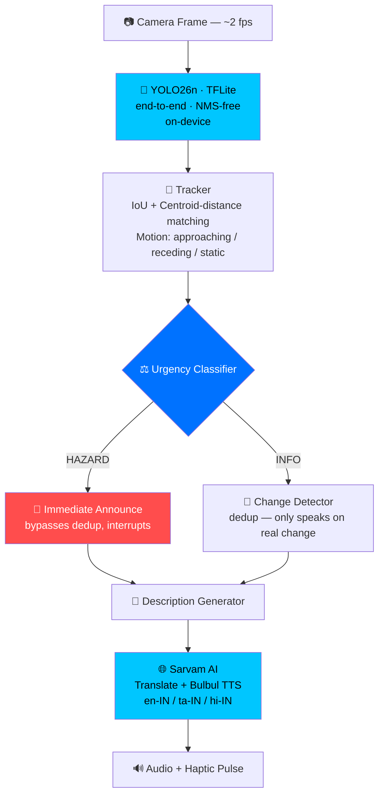

<picture>
  <source media="(prefers-color-scheme: dark)" srcset="https://capsule-render.vercel.app/api?type=waving&color=0:00c6ff,100:0072ff&height=220&section=header&text=LensVoice&fontSize=60&fontColor=fff&animation=fadeIn&fontAlignY=38">
  
</picture>

<p align="center">
  
</p>

<p align="center">
  
  
  
  
</p>

<p align="center">
  <a href="#-the-problem"></a>
  <a href="#-architecture"></a>
  <a href="#-the-model"></a>
  <a href="#-training"></a>
  <a href="#-tech-stack"></a>
</p>

<p align="center">
  
</p>

---

## 🧠 The Problem

> *"Every 6 seconds, someone in the world becomes blind."* — WHO

There are **285 million visually impaired people** globally. Navigation is their single biggest daily challenge — crossing a road, walking through a crowded market, detecting an approaching vehicle.

Existing solutions are either:
- **Hardware-locked** (expensive smart canes, camera-equipped white canes)
- **Backend-dependent** (require constant WiFi + a server — fail in the real world)
- **Silent on hazards** (GPS apps don't tell you about the auto-rickshaw speeding toward you)

**LensVoice is the alternative.** A single APK. Zero infrastructure. Your phone becomes a real-time co-pilot that speaks in your language.

---

## 🎯 The Vision

This is not a "research demo." This is a working proof that the software layer for the next generation of **AI-assisted accessibility wearables** doesn't need a data center behind it.

- **Glasses-ready architecture:** the same on-device pipeline (TFLite → Tracker → Urgency → TTS) that runs on a phone today is the exact pipeline dedicated glasses hardware with an NPU would run tomorrow — no redesign needed, just a smaller camera.
- **Language-native:** English, Tamil, Hindi at launch, powered by Sarvam AI's Indian-language-first models. Not gating accessibility behind English literacy.
- **Privately yours:** no backend server, no images ever leave the device. The only network call is to Sarvam for translation + speech synthesis.

> **"If a visually impaired person can't afford $3,000 smart glasses, their phone + LensVoice should be enough."**

---

## 🏗️ Architecture


```mermaid
flowchart TD
    A["📷 Camera Frame — ~2 fps"] --> B["🧠 YOLO26n · TFLite<br/>end-to-end · NMS-free<br/>on-device"]
    B --> C["🎯 Tracker<br/>IoU + Centroid-distance matching<br/>Motion: approaching / receding / static"]
    C --> D{"⚖️ Urgency Classifier"}
    D -->|HAZARD| E["🚨 Immediate Announce<br/>bypasses dedup, interrupts"]
    D -->|INFO| F["🔁 Change Detector<br/>dedup — only speaks on real change"]
    E --> G["📝 Description Generator"]
    F --> G
    G --> H["🌐 Sarvam AI<br/>Translate + Bulbul TTS<br/>en-IN / ta-IN / hi-IN"]
    H --> I["🔊 Audio + Haptic Pulse"]

    style B fill:#00c6ff,color:#000
    style D fill:#0072ff,color:#fff
    style E fill:#ff4d4d,color:#fff
    style H fill:#00c6ff,color:#000
```

**Key design decisions:**
- **No backend.** The client is fully self-contained — YOLO inference runs on-device through a native TFLite/LiteRT runtime. The only internet dependency is Sarvam AI for translation + TTS.
- **Hazards interrupt.** Info announcements queue. If a car is approaching while the app is mid-sentence about a traffic sign, *the car wins* — urgency is not up for debate.
- **Change detection prevents spam.** The `ChangeDetector` remembers what was last said about each object and only re-announces if position or distance changes meaningfully.
- **Tracker uses centroid fallback, not just IoU.** When an object moves fast between frames and bounding boxes barely overlap, pure IoU-matching loses track of it — a real bug caught and fixed during development. Centroid-distance as a fallback signal keeps tracking stable even on fast-approaching hazards.

<details>
<summary><strong>🩻 Click to see the on-device inference internals</strong></summary>

<br>

YOLO26 ships an **end-to-end, NMS-free detection head**, so the exported model
hands back boxes that are already decoded and deduplicated — `[1, 300, 6]`:

```
x1, y1, x2, y2, conf, class_id     # box in pixels of the input square
```

That removes the entire fragile post-processing stage most YOLO deployments
carry on the client: no grid decoding, no sigmoid+argmax over class rows, no
hand-rolled greedy NMS with an IoU threshold to tune. The client filters by
confidence and draws. Fewer moving parts on-device is exactly what you want
when the target is a phone — and eventually glasses.

Export shape and tensor layout are verified at export time rather than
assumed, since the ONNX→TF conversion can silently flip NCHW to NHWC:

```bash
python training/export_model.py <best.pt> --format tflite --imgsz 640
```

</details>

---

## 📊 The Model

| Detail | Value |
|---|---|
| **Architecture** | YOLO26 Nano (Ultralytics, 2026 release — NMS-free, edge-first) |
| **Training Data** | Indian Driving Dataset (IDD), via Roboflow — 44,331 annotated images, 12 classes |
| **Training Environment** | CUDA (RTX 4050, 6 GB) — fully resumable across sessions |
| **Classes** | animal, autorickshaw, bicycle, bus, car, motorcycle, person, rider, traffic light, traffic sign, truck, vehicle fallback |
| **Training Resolution** | 640×640 — the dataset's native letterbox size, so no detail is resized away |
| **Export Format** | TFLite / ONNX / CoreML float32 — input size set by the client |
| **Inference** | On-device, real-time on mid-range Android hardware |

### Why YOLO26n?

Ultralytics' newest generation, purpose-built for edge and low-power deployment — NMS-free architecture removes a traditionally fragile, hyperparameter-sensitive post-processing step, which matters a lot when you're squeezing inference onto a phone rather than a GPU server.

### Why IDD?

Indian roads are fundamentally different from the driving datasets (COCO, Cityscapes) most pretrained models learn from — shared lanes, auto-rickshaws, stray animals, informal traffic patterns. A model trained on Western road imagery misses exactly the object types that matter most here. IDD closes that gap.

> **Honest note on model maturity:** the early checkpoints were genuinely
> undertrained — the best reached mAP50 0.084, because each epoch took ~41
> minutes on Apple MPS and no run ever got past epoch 10 of 30. That was a
> compute ceiling, not a recipe problem. The full 150-epoch run at 640 on
> CUDA is the current phase, and it targets mAP50 in the 0.40–0.50 range.
> Small and distant objects were the weakest area before and are exactly what
> the higher training resolution is meant to fix.

---

## 🔥 Tech Stack

<div align="center">

| Layer | Technology |
|---|---|
| **Object Detection** | Ultralytics YOLO26n — end-to-end, NMS-free |
| **Training** | PyTorch + CUDA, 640×640, resumable |
| **Dataset** | India Driving Dataset (IDD) via Roboflow |
| **Export Targets** | TFLite / LiteRT · ONNX · CoreML |
| **Translation + TTS** | Sarvam AI (Mayura translate + Bulbul v3 TTS) |
| **Client** | React Native — planned |
| **Accessibility** | Native TalkBack/VoiceOver semantics, haptic hazard alerts |

</div>

---

## 🏋️ Training

### Prerequisites
- NVIDIA GPU, driver 550+ (`nvidia-smi` should report CUDA 12.4 or newer)
- Python 3.11 or 3.12 — **not** 3.13/3.14, the CUDA wheels are unreliable there
- ~20 GB free disk, 16 GB system RAM

### Setup

```bash
git clone https://github.com/vinoth12345678910/lens-voice.git
cd lens-voice

python -m venv venv && source venv/bin/activate   # Windows: venv\Scripts\activate
pip install torch torchvision --index-url https://download.pytorch.org/whl/cu126
pip install -r training/requirements-gpu.txt

python -c "import torch; print(torch.cuda.is_available())"   # must print True
```

If that prints `False`, pip resolved the CPU-only build — reinstall torch with
the `--index-url` included.

### Train

```bash
python training/train_gpu.py --stage smoke --batch 16                      # 10 min, verifies setup
python training/train_gpu.py --stage main --imgsz 640 --epochs 150 --batch 32
```

Every stage is resumable — re-run the identical command after a crash, a sleep
or a Ctrl+C and it continues from `last.pt`. The full run is ~24–30 h on a
4050 and is meant to be spread across nights.

> The dataset lives outside git (2.6 GB). See `training/README.md` for the full
> recipe, convergence guidance and how to tell when the model is done.

---

## 🧪 Future Roadmap

- [ ] **Edge NPU acceleration** — Google Coral / MediaTek NPU delegates for a true glasses form factor
- [ ] **Offline TTS fallback** — pre-cached voices for zero-connectivity use
- [ ] **Depth estimation** — monocular depth (MiDaS-class model) for real distance, not bounding-box-size proxies
- [ ] **Full hazard life-cycle narration** — "approaching" → "passing" → "passed," not single-shot callouts
- [x] **Larger model / longer training pass** — in progress: full 150-epoch run at 640 on CUDA
- [ ] **React Native client** — rebuild the on-device pipeline on RN once the v2 model lands

---

## 📄 License

MIT — because accessibility should not be paywalled.

---

<p align="center">
  <strong>Built for the 285 million people who navigate a sighted world every day.</strong><br>
  <em>One APK. Zero excuses.</em>
</p>

<p align="center">
  <a href="https://github.com/vinoth12345678910/lens-voice">
    
  </a>
  <a href="https://github.com/vinoth12345678910/lens-voice/issues">
    
  </a>
</p>

<picture>
  <source media="(prefers-color-scheme: dark)" srcset="https://capsule-render.vercel.app/api?type=waving&color=0:0072ff,100:00c6ff&height=120&section=footer">
  
</picture>
